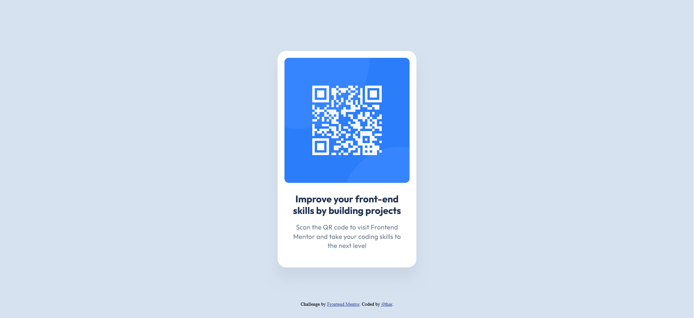

# Frontend Mentor - QR code component solution

This is a solution to the [QR code component challenge on Frontend Mentor](https://www.frontendmentor.io/challenges/qr-code-component-iux_sIO_H). Frontend Mentor challenges help you improve your coding skills by building realistic projects.

## Table of contents

- [Overview](#overview)
  - [Screenshot](#screenshot)
  - [Links](#links)
- [My process](#my-process)
  - [Built with](#built-with)
  - [What I learned](#what-i-learned)
- [Author](#author)

## Overview

### Screenshot



### Links

- Solution URL: [Solution](https://github.com/j0th4r/qr-code-component)
- Live Site URL: [Live Site](https://qr-code-component-rouge-tau.vercel.app/)

## My process

### Built with

- Semantic HTML5 markup
- Flexbox

### What I learned

While working on this challenge, I discovered the utility and flexibility of the calc() function in CSS. The calc() function allows dynamic calculations directly in the stylesheets, enabling more adaptable and maintainable layouts. Specifically, I used it to account for padding when defining the dimensions of elements.

```css
.card {
  padding: 16px;
  padding-bottom: 40px;
  height: calc(499px - 16px - 40px);
}

.description {
  padding: 0 16px;
  width: calc(288px - 16px - 16px);
}
```

## Author

- Frontend Mentor - [@j0th4r](https://www.frontendmentor.io/profile/j0th4r)
